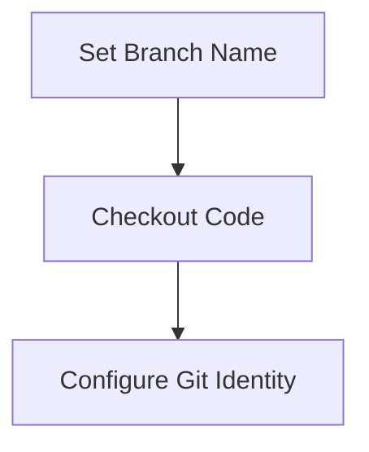
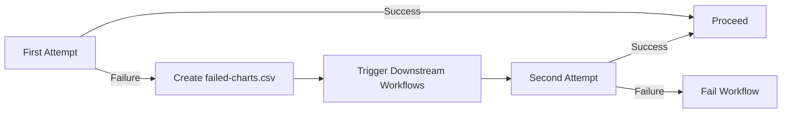
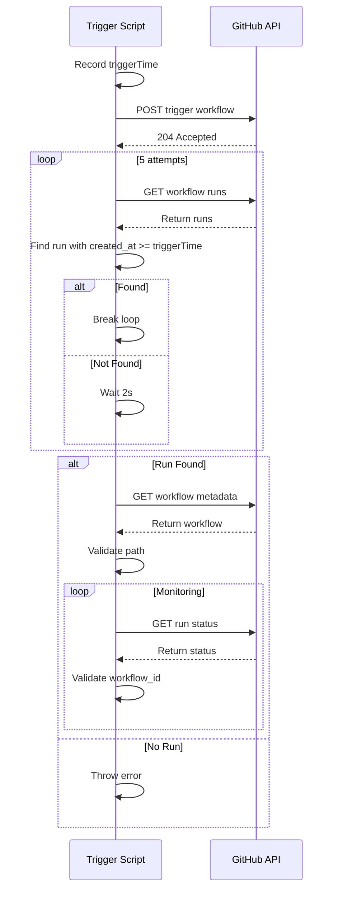
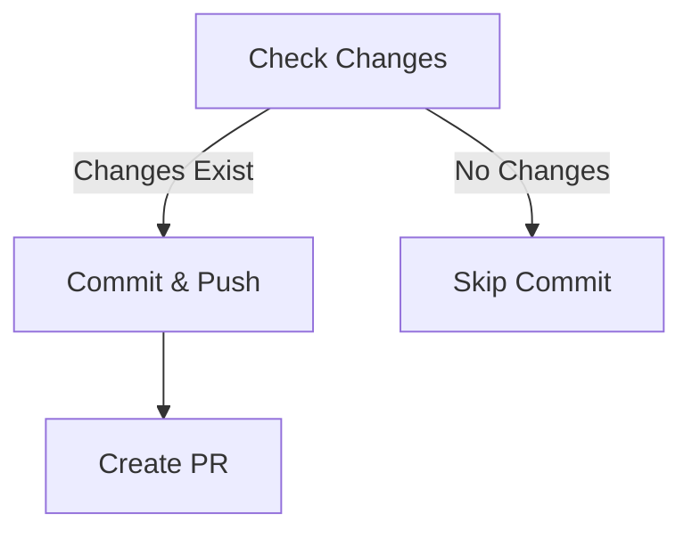
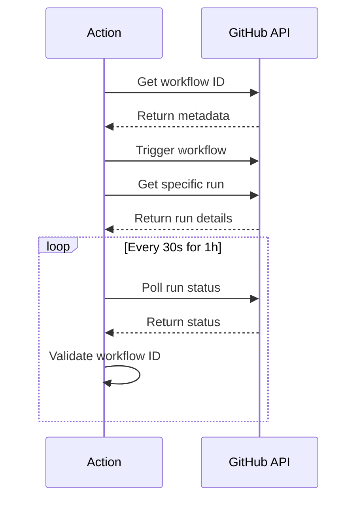

# Platform Release Automation Workflow  to rc-next environment

**Complete Documentation**  

---

### **1. Workflow Overview**  
**Purpose:** Automate platform chart updates and release PR creation  
**Key Features:**  
- Version synchronization across repositories  
- Helm dependency management  
- Downstream workflow orchestration  
- Automatic PR generation  
- Enterprise-grade security validation  

---

### **2. Step-by-Step Process**  

#### **2.1 Initialization**  
**Trigger:** Manual dispatch with required inputs  
**Input Validation:**  
- `release_version` (Format: x-x-x)  
- `branch_name` (Base branch for PR)  
- Credentials (GitHub Token, Docker Hub, Helm Registry)  

---

#### **2.2 Branch Management**  

**Output Branch:** `platform-<release_version>`  

---

#### **2.3 Registry Authentication**  
**Secure Credential Handling:**  
```bash  
# Docker Hub  
echo "$DOCKERHUB_TOKEN" | docker login -u "$DOCKERHUB_USER"  
# Helm Registry  
echo "$GITHUB_TOKEN" | helm registry login "$HELM_REGISTRY" -u "$HELM_USER"  
```  

---

#### **2.4 Chart Version Updates**  
**Script:** `platform-get-versions-from-service.sh`  
**Process:**  
1. Update platform chart version  
2. Query dependent repositories for:  
   - Branches matching `platform-<release_version>`  
   - Latest chart versions  
3. Update `Chart.yaml` dependencies  

---

#### **2.5 Helm Dependency Processing**  
**Two-Phase Validation:**  


---

#### **2.6 Downstream Workflow Triggering**  

**Validation Flow:** 



**Critical Checks:**  
- Workflow ID match pre/post trigger  
- Run ownership validation during polling  

---

#### **2.7 Final Verification**  
**Strict Requirements:**  
- All dependencies must resolve  
- Zero tolerance for failures in second attempt  
- Immediate workflow termination on any error  

---

#### **2.8 Change Detection & PR Creation**  
**Conditional Logic:**  

**Safety Nets:**  
- No empty commits  
- PR base branch validation  

---

### **3. Security Features**  

| Feature | Implementation |  
|---------|----------------|  
| Credential Handling | Encrypted secrets, never logged |  
| Workflow Validation | Triple-layer ID verification |  
| API Security | Scoped tokens, least privilege |  
| Audit Trail | Commit signatures, PR paper trail |  

---

### **4. Error Handling Matrix**  

| Error Type | Handling | Recovery |  
|------------|----------|----------|  
| Workflow ID Mismatch | Immediate failure | Manual investigation |  
| Dependency Resolution Failure | Retry after downstream workflows | Automatic |  
| API Rate Limiting | Exponential backoff | Auto-retry 3x |  
| Invalid Chart Versions | Fail fast | Manual correction |  

---

### **5. Observability**  

#### **5.1 Log Structure**  
```json  
{  
  "timestamp": "ISO-8601",  
  "stage": "helm-deps|trigger|commit",  
  "repo": "target-repo",  
  "workflow_id": 12345,  
  "run_id": 67890,  
  "status": "started|in_progress|completed",  
  "duration_sec": 120  
}  
```  

#### **5.2 Key Metrics**  
- Success rate per repository  
- Average dependency resolution time  
- Workflow trigger latency  

---

### **6. Validation Workflow**  



---

### **7. Critical Conditionals**  

| Step | Condition | Action |  
|------|-----------|--------|  
| Helm Deps 1 | Any failures | Create failed-charts.csv |  
| Trigger | failed-charts.csv exists | Start downstream workflows |  
| Helm Deps 2 | Failures exist | Fail entire workflow |  
| Commit | Changes detected | Create PR |  

---

### **8. Performance Characteristics**  

| Metric | Threshold |  
|--------|-----------|  
| Max Concurrent Triggers | 5 workflows |  
| Polling Interval | 30 seconds |  
| Total Timeout | 1 hour |  
| API Retries | 3 attempts |  

---

### **9. Recovery Procedures**  

**Scenario 1: Stuck Workflow**  
1. Check monitoring logs  
2. Verify downstream workflow status  
3. Manual termination if needed  

**Scenario 2: ID Mismatch**  
1. Review workflow configuration  
2. Verify repository permissions  
3. Rotate credentials if compromised  

---

This documentation provides complete operational visibility while maintaining security rigor. For implementation details, refer to the [source code](#) and [workflow definitions](#).